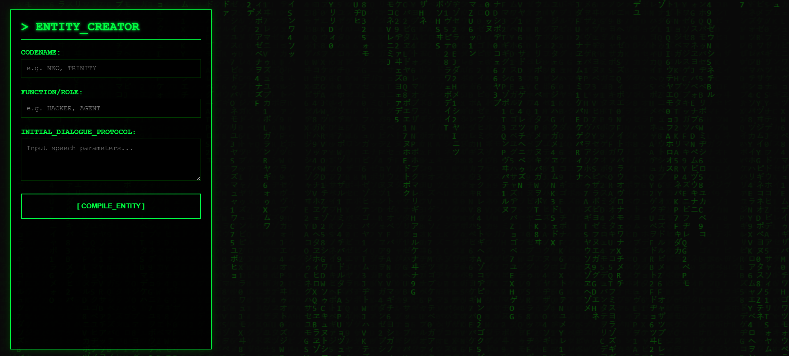

# THE CONSTRUCT: Entity Injection Terminal

**THE CONSTRUCT** is a browser-based simulation node designed to bypass high-level graphical user interfaces (GUIs) and interact directly with the source code of the simulated reality. It is a single-file, zero-dependency environment that treats character generation not as "creative writing," but as **code compilation**.

This is not a game. It is a visual interface for data object instantiation.

### // SYSTEM SPECIFICATIONS

-   **Atmospheric Core:** Runs a continuous, canvas-based "Digital Rain" loop for cognitive immersion.
    
-   **Auditory Feedback:** Utilizes the browser’s native SpeechSynthesis API to vocalize entity protocols upon instantiation.
    

### // THE PHILOSOPHY

Most interfaces coddle the user with rounded corners and soft transitions. **THE CONSTRUCT** rejects this. It assumes the user is an **Operator**, requiring raw data fields, hex-based identification tags, and terminal aesthetics.

It poses the fundamental question: When you type a name into a box and press enter, are you creating a soul, or just allocating memory?

### // DEPLOYMENT

1.  Initiate index.html.
    
2.  Input parameters (Codename, Function, Dialogue).
    
3.  Compile.
    
4.  **Watch the system react.**